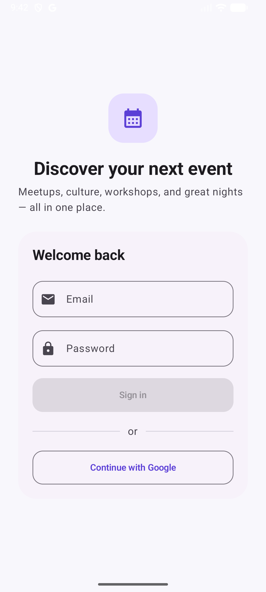
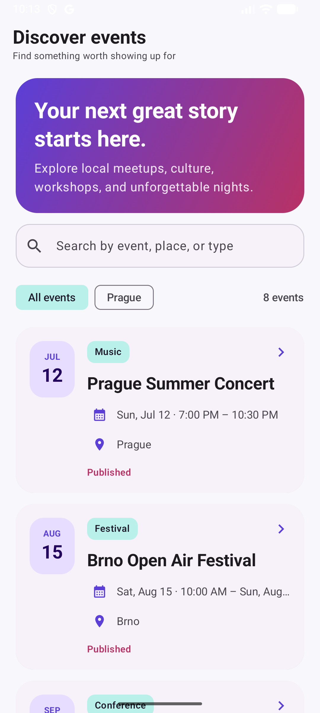

# EventApp Android

A polished Android client for discovering local events. The app supports email/password and Google sign-in, stores JWT credentials, and loads secured event data from a separate Spring Boot API.

| Sign in | Event discovery |
| --- | --- |
|  |  |

## Highlights

- Kotlin and Jetpack Compose UI with Material 3
- Email/password and Google authentication
- JWT-secured REST integration with Retrofit
- Event list and detail screens with resilient date and nullable-data formatting
- Clear loading, empty, and error states
- Unit tests, Android lint, and CI verification

## Run locally

Requirements: Android Studio, JDK 17+, Android SDK, and the [EventApp backend](https://github.com/DyshliukIvan/events-app-backend) running on port `8080`.

```powershell
$env:JAVA_HOME="E:\AndroidStudio\jbr"
.\gradlew.bat test assembleDebug lintDebug
```

The emulator uses `http://10.0.2.2:8080/`, which maps to the host machine. Optional values can be set in `gradle.properties`:

```properties
EVENTAPP_API_BASE_URL=http://10.0.2.2:8080/
GOOGLE_WEB_CLIENT_ID=your-web-client-id.apps.googleusercontent.com
```

Google sign-in additionally requires OAuth configuration for application ID `com.dyshiuk.eventapp` and the signing certificate SHA-1.
